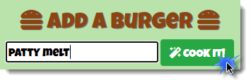
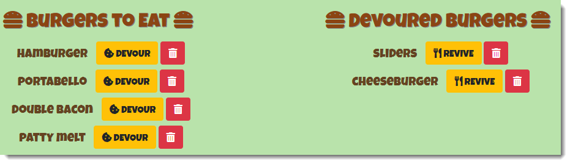
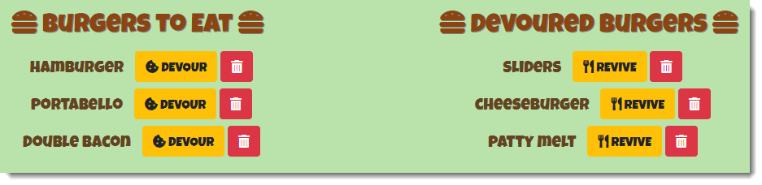
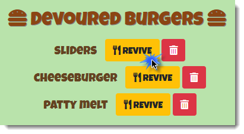

# Eat-Da-Burger!

### Unit 13: Node Express Handlebars

## Description

Hungry? Then it's time to Eat-Da-Burger! Have some fun with this Eat-Da-Burger app that showcases node express handlebars. You can create a burger, devour it, revive it, or delete it. Enjoy!

Access the deployed Heroku app here: https://young-caverns-86793.herokuapp.com/  (can you name the movie and the video game portrayed in the gifs?)

Access the git repo here: https://github.com/cbayley-edu/eat-da-burger

## Table of Contents 

* [Installation](#installation)
* [Usage](#usage)
* [License](#license)
* [Questions](#questions)

## Installation 

Since this is a Heroku app, there is no installation required however, if you want to clone or fork my github repo, feel free to do so. You'll have to setup your own JawsDB Add-on in Heroku to store your own burgers.

## Usage

Visit the Heroku app URL to use the application: https://young-caverns-86793.herokuapp.com/ 

To enter a new burger, type the burger name and click the magic wand.

The burger will appear under 'BURGERS TO EAT'.

To devour a burger, click on the eaten cookie button

The burger will move to the right, under 'DEVOURED BURGERS'.

To revive a devoured burger, click on the fork and knife button to remake it.

The burger will move back to the left under 'BURGERS TO EAT'.

You can delete burgers from either list by clicking the red trash can button.

The burgers are now gone forever...

...or are they?

"Cheeburger, cheeburger, cheeburger, cheeburger, cheeburger, cheeburger, cheeburger, cheeburger, cheeburger! Eh?"

## License 

This project is covered by the above license(s). Click on the badge for more information.

## Questions 

GitHub username: cbayley-edu
GitHub profile link: https://github.com/cbayley-edu

Please email me at christinabayley@comcast.net with any questions you have or any issues you come across.

Answers for Gifs: Movie reference is Better off Dead and video game is Pacman. Old SNL skit was referenced in the instructions too! Cheeburger.

